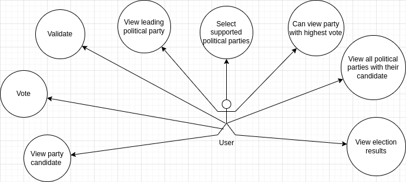

# e-voting
<h1>Application Requirements Data</h1>

<h2>User</h2>
- Is validated using his VIN (Voters Identification Number)
- Can see all political parties with their candidate
- Can select a supported political party 
- Vote for a supported political party
- Can see the leading political part
- Can see the highest vote cast for a political party
- Can see political party candidate information.
- Can see the result of the election

